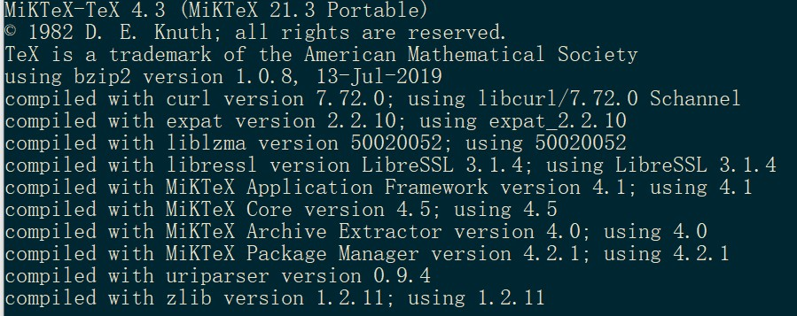

# 自制天津工业大学本科毕业论文LATEX模板（娱乐非官方）
本模板改自：https://github.com/BHOSC/BUAAthesis ，着重强调这个模板是自己写着玩的，工大没有latex模板，用latex写完学校查重和提交论文也不支持这个格式，word模板在`word模板`文件中。
## 写这个模板的原因
1. 没有学过word排版
2. word的排版太丑相对于latex
3. word公式太难输入
4. 十分想学习latex
5. 无聊
## 运行环境
1. 系统：win10和linux系统下都可以正常运行
2. latex版本：

3. 编辑器
	vscode
4. 对应插件
- LaTeX language support
- LaTeX Workshop
- Unicode Latex
4. 编译选项
- [settings.json](settings.json)
## 成品
- [初稿](初稿.pdf)
- [终稿](终稿.pdf)
## 感想
latex编出的界面好看，输入公式非常爽。用这种语言写论文简直是一种享受。